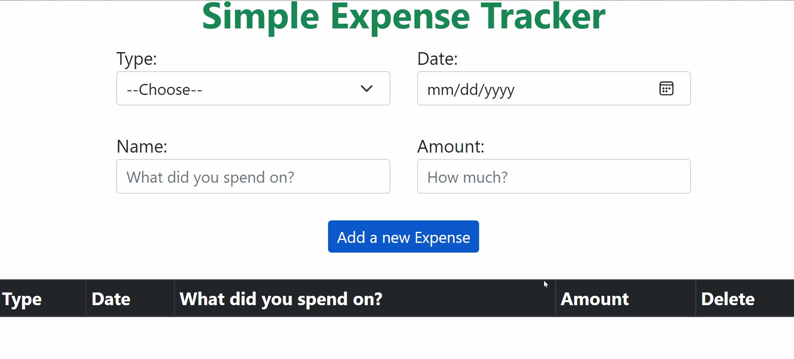

# **React Expense Tracker**

 This application is built in ***React***

 Working Version ***[here](Demo_Note_Taking_App.gif)***

# **Summary**

* This application allows the user to write and save their expenses by clicking  **Add a new Expense** button. 
* This is my very first application created using React. Once I implemented props, functional components, useState and useEffect, I was thoroughly impressed by what React could do. I also like how convenient Bootstrap classes, which I can use for styling in React.

* **Tools Used:** 
  * useState
  * useEffect 
  * Local Storage
  * props
  * Functional Components
  * onClick EventListener

# Author
Komal - | Software Developer | [Note Taking App](https://komalgill0310.github.io/Note-taking-Application/) | [LinkedIn](https://www.linkedin.com/in/komalpreet-kaur-3b6924177/)
